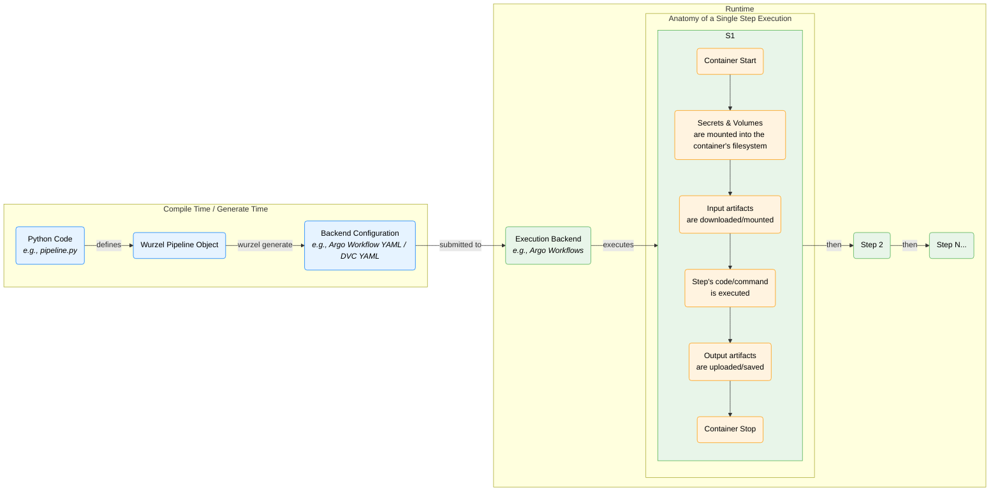

# Runtime vs. Generate Time

This document explains the two main phases of a `wurzel` pipeline: **Generate Time** and **Runtime**.

## Key Concepts

### Generate Time (or Compile Time)
-   **What it is:** This is the phase where your Python pipeline definition is converted into a concrete, executable workflow for a specific backend (like Argo Workflows or DVC).
-   **Trigger:** You run the `wurzel generate` command.
-   **Input:** Your Python script containing a `wurzel` pipeline definition.
-   **Output:** A configuration file (e.g., a `.yaml` file for Argo) that describes every step, their dependencies, the container images to use, and the commands to run.

### Runtime
-   **What it is:** This is the phase where the pipeline is actually executed by the backend.
-   **Trigger:** You submit the generated configuration file to the backend (e.g., using `argo submit` or `dvc repro`).
-   **Process:** The backend reads the workflow and executes the steps in the correct order.
-   **Important Aspects during a Step's Runtime:**
    -   **Containerization:** Each step typically runs in its own isolated container.
    -   **Secret Mounting:** Before your code runs, the backend mounts secrets (like API keys or database credentials) and configurations securely into the container's filesystem. Your code can then read them as if they were local files.
    -   **Data I/O:** The step downloads its necessary input artifacts, executes its logic, and uploads its resulting output artifacts.
